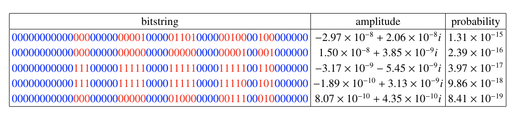

# Simulating the Sycamore quantum supremacy circuit

This repo contains code and data we have obtained in simulating the Sycamore quantum supremacy circuits with $n=53$ qubits, $m=20$ cycles using a tensor network based method call big-head proposed in [arXiv:2103.03074](http://arxiv.org/abs/2103.03074).

## Explanation of data

1. `data/circuit_n53_m20_s0_e0_pABCDCDAB.py` is the circuit file which has been download from the [Google's data repository for the Sycamore circuits](https://datadryad.org/stash/dataset/doi:10.5061/dryad.k6t1rj8).
2. `data/bipartition_n53_m20_s0_ABCD_s24_simplify_.txt` is the initial bipartition of the simplified tensor network corresponding to Sycamore circuit with 53 qubits, 20 cycles, seed 0, elide 0 and ABCDCDAB sequence. There are two lines in the file, the first line indicates the tail partition which includes 21 open qubits, while the second line includes the head partition with 32 closed qubits. The simplification of the tensor network is done by sequentially contracting tensors with 2 or less dimensions.
3. `data/n53_m20_s0_ABCD_s24_simplify_gpulimit_30_edges.txt`  contains the 23 slicing edges which splits the overall contraction task into $2^{23}$ subtasks, each of which has space complexity $2^{30}$ hence can be contracted using  fit into 32G memory.
4. `data/n53_m20_s0_ABCD_s24_simplify_gpulimit_30_ordernew.txt` includes the contraction order. For each edge in the contraction order, say $i, j$, the $i$th and $j$th tensor in the head partition will be contracted by tracing out the shared indices. Then the resulting tensor will be put back into the $i$th position.
5. [vector.pt](http://home.itp.ac.cn/~panzhang/sycamore/vector.pt) contains the cut tensor of of the head partition whose overall dimension is $2^{23}$ and the annotations of corresponding dimensions. The file is saved using `pytorch`, one can use `torch.load` to load the data.
6. The obtained $2^{21}$ samples for the Sycamore circuits with $n=53$ qubits and $m=20$ cycles and amplitudes are listed in `data/probs.txt` (extract the .tar.bz2 file) file, and their probabilities can be easily calculated accordingly. Notice that the configuration we assigned to all closed qubits are fixed to $\underbrace{0,0,0,\cdots,0}_{32}$, and the open qubit ids  are 11, 12, 13, 19, 20, 21, 22, 23, 28, 29, 30, 31, 32, 37, 38, 39, 40, 41, 44, 45, 46.

## Examples of running code

We give three examples here to introduce how to use our code to simulate random quantum circuits.

1. To get a good order with corresponding slicing edges (which will drop down the memory budget), you can run example code as
```python
python examples/find_order.py -n 53 -m 20 -seed2 4 -seed_mcmc 48 -simplify -sc 53 -tc 57
```
Then after around one hour (our codes currently do not support multi-threading, but will be added in the future), you can get a similar result as the order listed in the paper for Sycamore circuit `n53_m20_s0_e0_pABCDCDAB`.

2. To run an actual simulation of a Sycamore circuit, run 
```python
python examples/circuit_simulation.py -n 53 -m 12 -simplify -seed2 4 -sc 36 -tc 41 -cuda 0
```
This code will run the entire simulation (need around 5 minutes) of Sycamore circuit `n53_m12_s0_e0_pABCDCDAB`, the resulting cut vector and samples can be found in `bighead/samples`. Notice that you need a GPU with memory larger than 32G to run the code.

3. To get the full amplitude of a Sycamore circuit, run
```python
python examples/full_amplitude.py -n 38 -m 14 -seed2 3 -simplify -seq EFGH -cuda 0 -task_start 0 -task_end 1 -task_num 9
```
This code will ge the full amplitude (need around 20 minutes) of Sycamore circuit `n38_m14_s0_e0_pEFGH`, the resulting histogram data will be stored in `data/`, you still need a 32G GPU to run it.

## Notice

We noticed that in our paper  [arXiv:2103.03074](http://arxiv.org/abs/2103.03074) we have a misprint in the first row of Tab.III, where the `amplitude` should be `|amplitude|`. Nevertheless, we put the refined table below.



The $2^{21}$ bitstrings with amplitudes and probabilities can be found in the `data/probs.txt`.

